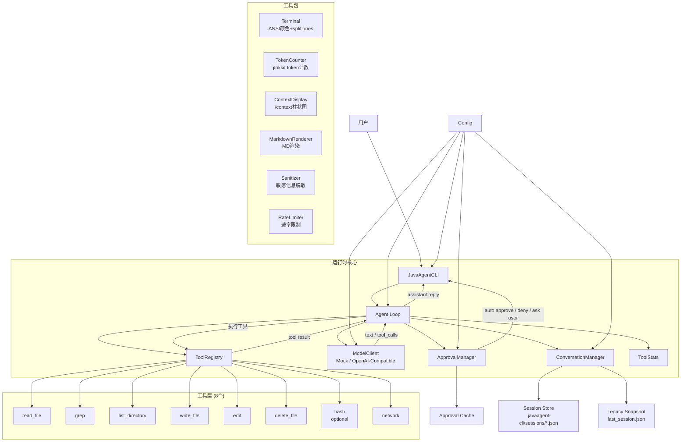
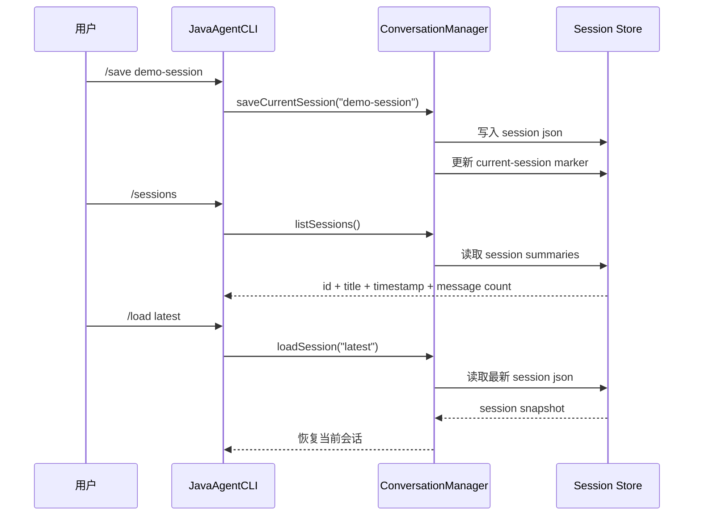

# JavaAgent CLI 架构报告

## 1. 项目定位

JavaAgent CLI 是一个 Claude Code 风格的 Java 命令行 Agent，演示工具调用的核心链路：

- 用户输入自然语言
- 模型决定是否发起 tool call
- 本地工具执行任务
- 工具结果回灌给模型
- 模型基于上下文生成最终回答
- 敏感操作必须经过审批
- 会话可以保存和恢复

课堂主线使用 mock 模式，保证演示稳定；real 模式作为加分项，证明同一套架构可以接入 OpenAI-compatible 服务，默认模型为 `gpt-5.4-mini`。

## 2. 总体架构



核心类职责：

- `JavaAgentCLI`：命令行入口，处理 `/help`、`/status`、`/mode`、`/context`、`/compact`、`/effort` 等 21 个斜杠命令，JLine3 终端支持。
- `Agent`：同步 agent loop，负责模型调用、工具执行、结果回灌，支持 thinking 模型推理链，LLM 摘要压缩。
- `ModelClient`：模型客户端接口，当前有 mock 和 OpenAI-compatible 两种实现，支持 SSE 流式输出。
- `ToolRegistry`：注册和查找工具，支持按名称和别名查找。
- `ApprovalManager`：审批策略、路径策略、审批缓存、bypass 模式。
- `ConversationManager`：上下文管理、多会话持久化、消息替换（用于 compact）。
- `Config`：配置加载和默认值管理，16 项配置参数。
- `ContextUsage`：上下文 token 使用量数据模型。
- `ToolStats`：工具执行统计（调用次数、总耗时、错误次数、平均耗时）。

## 3. 主运行流程

1. 用户在 CLI 输入请求。
2. `JavaAgentCLI` 把请求交给 `Agent.processTurn`。
3. `Agent` 构建 system prompt，把历史上下文、工具定义传给 `ModelClient`。
4. `ModelClient` 返回普通文本、`tool_calls` 或推理内容（thinking 模型）。
5. 如果是普通文本，直接输出并保存到会话。
6. 如果是 `tool_calls`：
   - `ToolRegistry` 查找工具。
   - `ApprovalManager` 判断是否自动通过、拒绝或请求用户审批。
   - 工具执行后返回 `ToolExecutionResult`，`ToolStats` 记录统计。
   - 工具结果经 `Sanitizer` 脱敏后作为 tool message 加入上下文。
   - 如果同一工具连续失败 3 次，自动中断循环。
7. `Agent` 再次调用模型，让模型基于工具结果生成最终回答。
8. `ConversationManager` 自动保存当前会话。

这个流程是同步的，适合课堂讲解，也方便单元测试覆盖。

## 4. 工具层设计

### 4.1 完整工具列表（8 个）

| 工具 | 别名 | 说明 | 审批 |
|------|------|------|------|
| `read_file` | `cat` | 读取文本文件，支持行范围 | 自动通过 |
| `grep` | `search`, `find` | 正则搜索文本，最多扫描 200 文件 | 自动通过 |
| `list_directory` | `ls`, `dir` | 列出目录内容 | 自动通过 |
| `write_file` | `write`, `save_file` | 写入文件（带 60 行预览） | 需要审批 |
| `edit` | `replace`, `sed` | 精确字符串替换（带 diff 预览） | 需要审批 |
| `delete_file` | `rm` | 删除文件 | 需要审批 |
| `bash` | `shell`, `exec` | 执行 shell 命令 | 需要审批（默认关闭） |
| `network` | `http`, `fetch` | HTTP GET/POST/PUT/DELETE 请求 | 需要审批 |

### 4.2 工具抽象

所有工具统一实现 `Tool` 接口：

- `definition()` → 返回 `ToolDefinition`（名称、描述、参数 Schema、别名、readOnly/destructive 标记）
- `execute(Map<String, Object>)` → 返回 `ToolExecutionResult`（成功内容或错误信息）
- `configure(Path workspaceRoot)` → 可选，配置工作区根目录用于路径安全检查

这样模型只需要看到工具定义，Agent 只需要按统一接口执行工具。

### 4.3 插件系统

通过 `ToolProvider` SPI 接口，外部插件可以自动注册自定义工具：

```java
public interface ToolProvider {
    List<Tool> tools();
}
```

在 `META-INF/services/com.javagent.tools.ToolProvider` 中注册即可，无需修改核心代码。

## 5. 权限和审批规则

### 自动通过

- `read_file`
- `grep`
- `list_directory`

### 需要审批

- `write_file`
- `edit`
- `delete_file`
- `bash`
- `network`

### 直接拒绝

- bash 未启用时调用 `bash`
- 访问 workspace 外路径，且 `allowExternalPaths=false`
- 修改 `.git`、`.javaagent-cli`、配置文件或 session 内部状态
- 删除 workspace 根目录
- 删除目录
- 覆盖二进制文件

### Bypass 模式

可通过 `/bypass on` 跳过所有工具审批确认（后果需自行承担）。

### 审批缓存

相同危险操作会复用之前的审批结果，减少重复确认。可以用下面命令清空：

```text
/approvals clear
```

## 6. 安全机制

### 6.1 工作区隔离

所有文件操作限制在项目目录内，通过 `FileToolSupport.checkInsideWorkspace` 检查。

### 6.2 危险命令检测

BashTool 内置 10 类正则匹配检测危险命令：

- `rm -rf /`、`rm -rf *`
- Fork bomb（`:(){ :|:& };:`）
- Reverse shell（`nc -e`、`bash -i`）
- `mkfs`、`dd if=`
- `chmod 777`、`chown root`
- 等等

### 6.3 敏感信息脱敏

`Sanitizer` 工具类在存储到会话历史前过滤 API Key/Token：

- `sk-xxx` 格式的 API 密钥
- `Bearer xxx` 格式的 Token
- `api_key=xxx` 格式的配置值
- `tp-xxx` 格式的 Token

### 6.4 连续失败保护

同一工具连续失败 3 次自动中断 Agent 循环，防止死循环。

### 6.5 速率限制

`RateLimiter` 使用令牌桶算法控制 API 请求频率，避免触发限流。

## 7. SSE 流式输出

`OpenAiCompatibleModelClient` 实现真正的 Server-Sent Events 流式处理：

```
请求体新增：
  "stream": true
  "stream_options": { "include_usage": false }

处理流程：
  1. 使用 HttpClient.BodyHandlers.ofLines() 逐行读取 SSE 事件流
  2. 解析每个 "data:" 行的 JSON
  3. 提取 delta.content 并实时调用 streamHandler.onChunk()
  4. 增量解析工具调用的 id/name/arguments（流式工具调用支持）
  5. [DONE] 事件结束流
```

支持 thinking 模型的 `reasoning_content` 字段，推理过程实时输出。

## 8. Thinking 模型支持

- `reasoningContent` 字段贯穿 Message → ModelResponse → Agent 全链路
- 自动解析 thinking 模型的推理内容
- API 因 reasoning_content 缺失报错时，自动清理旧上下文并重试

## 9. 会话持久化

会话相关能力：

- `/save [title]` 保存当前会话
- `/sessions` 列出历史会话
- `/load [id|title|latest]` 加载会话
- `/clear` 或 `/new [title]` 开启新会话
- `/export` 导出当前对话为 Markdown
- JVM Shutdown Hook 自动保存会话

存储位置：

- `.javaagent-cli/sessions/*.json`：多会话存储
- `.javaagent-cli/current-session.txt`：当前会话标记
- `last_session.json`：兼容旧版本的快照



## 10. Claude Code 风格 UI

### 10.1 终端渲染

- JLine3 `LineReader` 支持行编辑、方向键历史翻页、持久化输入历史
- 斜杠命令 Tab 自动补全
- ANSI 彩色输出（通过 `Terminal` 工具类，自动检测终端能力）
- Markdown-to-ANSI 渲染器（`MarkdownRenderer`），支持标题、代码块、加粗、列表

### 10.2 工具执行显示

方框边框风格显示工具执行过程：

```
┌─ edit test.txt ─────────────────────────┐
│  Edited D:\...\test.txt (-1 lines, +1)  │
└─────────────────────────────────────────┘
```

### 10.3 审批界面

```
? Approval required
  tool edit
  path: test.txt
  old_string: old "hello"
  new_string: new "world"
  preview:
  - hello                   ← 红色删除行
  + world                   ← 绿色新增行
  Approve? [y]es / [n]o / [c]ancel:
```

### 10.4 启动横幅

方框风格启动横幅（`BannerPrinter`），显示版本、工作目录、模式、模型、工具数量、会话恢复信息。

### 10.5 Braille 动画

思考中时显示 Braille 动画 spinner，审批时自动暂停。

## 11. 配置管理

14 项配置参数：

| 配置项 | 说明 | 默认值 |
|-------|------|-------|
| `agent.mock_mode` | 是否使用模拟模式 | `true` |
| `agent.api_key` | API 密钥 | 空 |
| `agent.base_url` | API 基础 URL | `https://api.openai.com/v1` |
| `agent.model` | 模型名称 | `gpt-5.4-mini` |
| `agent.auto_save` | 是否自动保存会话 | `true` |
| `agent.max_iterations` | 最大工具调用循环次数 | `12` |
| `agent.enable_bash` | 是否启用 Bash 工具 | `false` |
| `agent.stream_responses` | 是否流式输出响应 | `true` |
| `agent.system_prompt` | 自定义系统提示词 | 空 |
| `agent.approval_cache` | 是否启用审批缓存 | `true` |
| `agent.allow_external_paths` | 是否允许访问工作区外路径 | `false` |
| `agent.bypass_permissions` | 是否跳过所有工具审批确认 | `false` |
| `agent.effort` | 推理深度 | `medium` |
| `agent.max_tokens` | 上下文窗口 token 数 | `200000` |
| `agent.compact_threshold` | 自动压缩阈值 | `0.8` |
| `agent.rate_limit_qps` | API 请求速率限制（每秒请求数） | `10` |

配置文件查找顺序：

1. 项目根目录（有 `pom.xml` 的目录）
2. 工作目录
3. `~/.javaagent-cli/config.properties`

运行时可通过 `/reload` 重载配置。

## 12. Mock 模式和 Real 模式

### Mock 模式

mock 模式是课堂主线，优点是：

- 不依赖网络
- 不依赖 API key
- 输出稳定
- 方便演示工具调用
- 方便做单元测试

mock 客户端会根据中文或英文关键词选择工具，例如"读取""搜索""列出""写入""删除""编辑""网络"。

### Real 模式

real 模式使用 `OpenAiCompatibleModelClient`，请求：

```text
{base_url}/chat/completions
```

当前默认模型：

```text
gpt-5.4-mini
```

real 模式可以证明模型客户端是可替换的，支持 SSE 流式输出和 thinking 模型，但它依赖网络、API key、代理服务和额度，所以只作为加分展示。

## 13. 为什么这个设计适合课程项目

- 体量小，能在一页架构图讲清楚。
- 链路完整，能展示真实 agent 工作流。
- 有安全边界，危险操作不是直接执行。
- 有 mock 模式，课堂演示稳定。
- 有 real 模式，可证明架构不是纯模拟。
- 有会话持久化，体现状态管理。
- 有 Maven 打包，可以交付可执行 jar。
- 有单元测试（66 个），能证明工程质量。
- 有 SSE 流式输出，展示现代 API 交互方式。
- 有 thinking 模型支持，展示推理链能力。
- 有插件系统，展示可扩展性。

## 14. 当前边界

这个项目有意保持课堂级复杂度，不做过度设计：

- real 模式依赖外部 API 服务，不保证 100% 可用。
- bash 默认关闭，不作为主线演示能力。
- 文件工具只面向安全的文本文件演示，不处理大文件或复杂二进制。
- network 工具需要外部网络可达，部分 URL 可能无法连接。

这些边界是为了保证项目小、清晰、可解释。

## 15. 答辩关键词

- synchronous agent loop
- tool calling
- tool-result feedback
- approval gate
- workspace-first permission policy
- approval cache
- bypass permissions
- multi-session persistence
- mock / real model switching
- OpenAI-compatible API
- SSE streaming
- thinking model support (reasoning_content)
- SPI plugin system
- consecutive failure protection
- rate limiting (token bucket)
- LLM-based context compaction
- token-level context visualization (jtokkit cl100k_base)
- cross-platform (Windows PowerShell/cmd.exe + macOS + Linux)
- sensitive information sanitization
- pure Java implementation
- executable fat jar
- 66 unit tests
